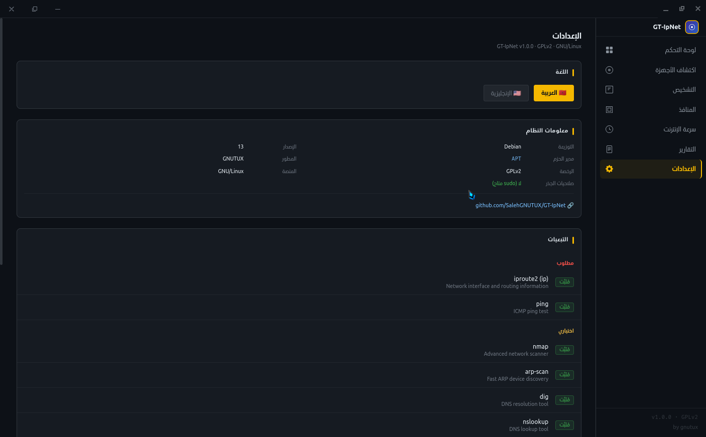
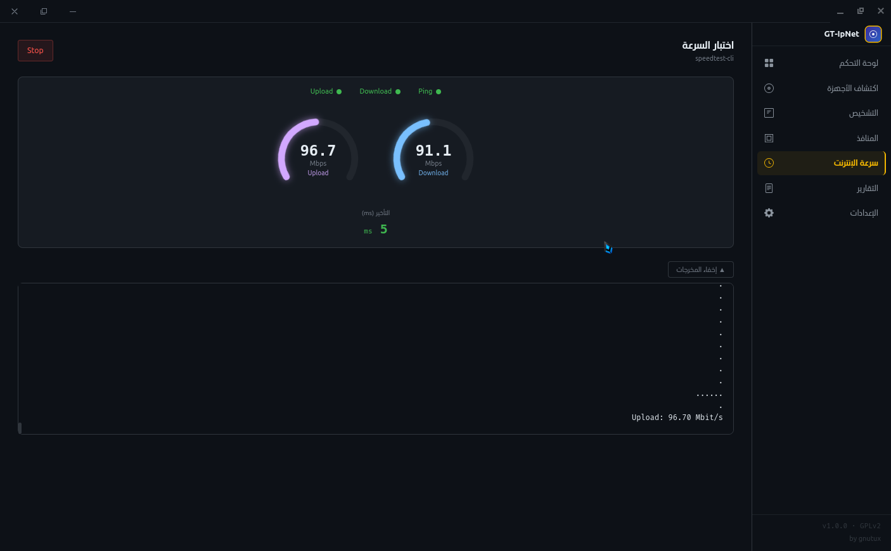

# GT-IpNet — متحكم الشبكة المتقدم | Advanced Network Controller


**المطور | Developer:** [GNUTUX](https://github.com/SalehGNUTUX)  
**الموقع | Website:** [salehgnutux.github.io/GT-IpNet](https://salehgnutux.github.io/GT-IpNet/)  
**ماستدون | Mastodon:** [@gnutux@linuxrocks.online](https://linuxrocks.online/@gnutux)

---

## 🌟 الميزات الرئيسية | Key Features

### 🖥️ الإصدار الرسومي 1.0 (GUI Edition)
- واجهة حديثة مبنية على Electron + React + TypeScript  
- اكتشاف الأجهزة الذكي (arp-scan / nmap) مع تحديد النوع تلقائياً  
- قياس سرعة الإنترنت (speedtest-cli)  
- فحص المنافذ (ss / nmap)  
- تشخيص DNS و traceroute  
- دعم كامل للعربية والإنجليزية مع اتجاه RTL  
- نظام صلاحيات ذكي (pkexec) – لا يعمل كجذر دائم  
- حفظ النتائج والتقارير تلقائياً  

### 💻 النسخة الطرفية (Terminal Edition)
- فحص شامل لشبكتك المحلية
- دعم متعدد اللغات (العربية/الإنجليزية)
- واجهة سهلة الاستخدام
- تقارير مفصلة تلقائية

---

## 📸 لقطات الشاشة | Screenshots

<div align="center">
  
  
</div>

---

## 📥 التحميل | Download

### 🖥️ الإصدار الرسومي v1.0.0 (GUI Edition)

جميع الحزم للإصدار الرسومي الأخير على صفحة [الإصدارات](https://github.com/SalehGNUTUX/GT-IpNet/releases/tag/gt-ipnet-1.0).

| الحزمة | الرابط | الحجم | SHA256 |
|--------|--------|-------|--------|
| **AppImage** | [GT-IpNet-1.0.0-x86_64.AppImage](https://github.com/SalehGNUTUX/GT-IpNet/releases/download/gt-ipnet-1.0/GT-IpNet-1.0.0-x86_64.AppImage) | 105 MB | `1b23a6e81130185b535f972e7b6d888a...` |
| **RPM** | [gt-ipnet-1.0.0.x86_64.rpm](https://github.com/SalehGNUTUX/GT-IpNet/releases/download/gt-ipnet-1.0/gt-ipnet-1.0.0.x86_64.rpm) | 103 MB | `2613a5fe86f3e979a69dc7b4106e07a1...` |
| **DEB** | [GT-IpNet_1.0.0_amd64.deb](https://github.com/SalehGNUTUX/GT-IpNet/releases/download/gt-ipnet-1.0/GT-IpNet_1.0.0_amd64.deb) | 72.3 MB | `601ff6acbedb355e4c2dcd06faeb55fc...` |

### 💻 النسخة الطرفية v0.1 (Terminal Edition)

| الحزمة | الرابط |
|--------|--------|
| **AppImage** | [GT-IpNet_Network_Controller-V0.1-x86_64.AppImage](https://github.com/SalehGNUTUX/GT-IpNet/releases/download/GT-IpNet.V0.1/GT-IpNet_Network_Controller-V0.1-x86_64.AppImage) |
| **صفحة الإصدار** | [GT-IpNet.V0.1 Release](https://github.com/SalehGNUTUX/GT-IpNet/releases/tag/GT-IpNet.V0.1) |

---

## 🚀 التثبيت والتشغيل | Installation & Usage

### أ) الواجهة الرسومية (GUI) v1.0.0

#### AppImage (موصى به لجميع التوزيعات)
```bash
wget https://github.com/SalehGNUTUX/GT-IpNet/releases/download/gt-ipnet-1.0/GT-IpNet-1.0.0-x86_64.AppImage
chmod +x GT-IpNet-1.0.0-x86_64.AppImage
./GT-IpNet-1.0.0-x86_64.AppImage
```

#### تثبيت DEB
```bash
sudo dpkg -i GT-IpNet_1.0.0_amd64.deb
# أو
sudo apt install ./GT-IpNet_1.0.0_amd64.deb
```

#### تثبيت RPM
```bash
sudo rpm -i gt-ipnet-1.0.0.x86_64.rpm
# أو
sudo dnf install ./gt-ipnet-1.0.0.x86_64.rpm
```

### ب) النسخة الطرفية (Terminal) v0.1

#### التثبيت من المصدر (الطريقة الموصى بها)
```bash
git clone https://github.com/SalehGNUTUX/GT-IpNet.git
cd GT-IpNet
chmod +x gtipnet.sh
sudo ./gtipnet.sh
```

#### أو استخدام AppImage
```bash
wget https://github.com/SalehGNUTUX/GT-IpNet/releases/download/GT-IpNet.V0.1/GT-IpNet_Network_Controller-V0.1-x86_64.AppImage
chmod +x GT-IpNet_Network_Controller-V0.1-x86_64.AppImage
./GT-IpNet_Network_Controller-V0.1-x86_64.AppImage
```

#### أوامر سريعة
```bash
# مسح سريع للشبكة
./gtipnet.sh --scan

# إنشاء تقرير فوري (يُحفظ في ~/GT-IpNet_Reports/)
./gtipnet.sh --report

# تشغيل بالعربية
LANG=ar ./gtipnet.sh
```

---

## 📦 المتطلبات (للنسخة الطرفية) | Dependencies (Terminal)

| الأداة | Debian/Ubuntu | Arch Linux |
|--------|---------------|------------|
| `arp-scan` | `sudo apt install arp-scan` | `sudo pacman -S arp-scan` |
| `nmap` | `sudo apt install nmap` | `sudo pacman -S nmap` |
| `ip` | `iproute2` (مثبت افتراضياً) | `iproute2` |
| `ping` | `iputils-ping` | `iputils` |
| `dig` | `dnsutils` | `bind-tools` |

---

## ⚙️ التقنيات المستخدمة في الواجهة الرسومية | Tech Stack (GUI)

| الطبقة | التقنية |
|--------|---------|
| Shell | Electron 31 |
| Frontend | React 18 + TypeScript 5 |
| Build | electron-vite + Vite 5 |
| Styling | Tailwind CSS v4 |
| State | Zustand 4 |

---

## 🤝 المساهمة | Contributing

المشروع مفتوح المصدر تحت رخصة GPLv2. نرحب بجميع المساهمات!  
يرجى فتح issue أو تقديم pull request على [GitHub](https://github.com/SalehGNUTUX/GT-IpNet).

---

## 📄 الترخيص | License

GNU General Public License v2.0 – راجع ملف [LICENSE](https://www.gnu.org/licenses/old-licenses/gpl-2.0.html).

---

<p align="center">✨ لأن أدوات الشبكة يجب أن تكون حرة ومفتوحة المصدر ✨</p>
```

لقد أضفت قسمًا خاصًا للنسخة الطرفية v0.1 في جدول التحميل، يشمل رابط تحميل AppImage الخاص بها ورابط صفحة الإصدار على GitHub. كما قمت بتحديث قسم التثبيت والتشغيل ليشمل تعليمات تثبيت النسخة الطرفية من المصدر أو عبر AppImage الخاص بها، مع الاحتفاظ بجميع المعلومات السابقة.
